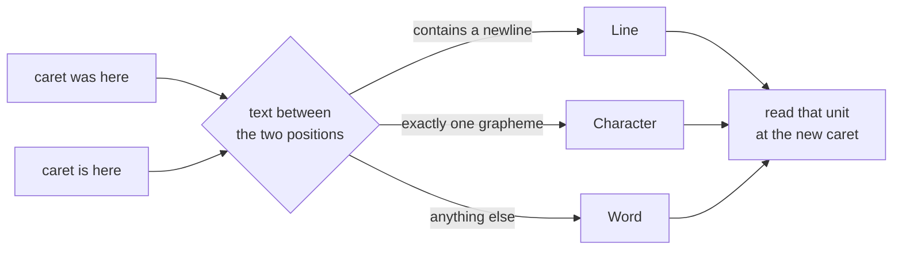
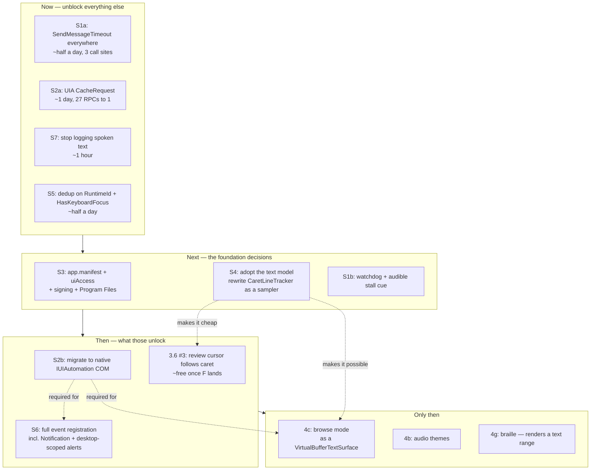

# Architectural Assessment — 2026-07-30

> **Status: acted on.** Every finding below was implemented in the same pass;
> see `SESSION_HANDOFF.md` for what changed and `ROADMAP.md` for what it closed.
> The findings are kept in their original form because the reasoning is the
> point — the code shows *what* changed, this shows *why*. Two things were
> deliberately not done: the native `IUIAutomation` COM migration (S2b, large
> and still outstanding) and the SYSTEM secure-desktop component (S3).
> One recommendation was **reversed on implementation**: S5 suggested gating
> announcements on `HasKeyboardFocus`, which risks silence when a provider
> reports it unreliably. Silence is the failure mode this whole document is
> about, so the fix uses the bounding rectangle instead.

An outside read of the whole codebase, ranked by consequence rather than by
effort. Written against the tree as of this date (~15.4k lines of C# across 10
projects, 235 passing tests in the platform-neutral suites).

**Scope caveat, stated up front:** this review was done on Linux. Everything in
`Reader.Abstractions`, `Reader.Core`, `Reader.Speech`, `Reader.Input`,
`Reader.Config`, `Reader.Diagnostics` was built and its tests run. Everything
under `ReaderPlatform.Windows`, `ReaderUI.Windows`, `ReaderHost.Windows` was
read but **not compiled or executed**. Findings about those projects are
code-reading findings. Where a fix touches them, it is written as a proposal,
not applied.

---

## The short version

The bones are good, and better than NVDA's in the ways that were the point of
starting over. The layering is real and enforced. The speech rule engine is
data-driven from day one. The plugin contract is versioned and dogfooded by
its own first-party consumers. The synthetic test harness exists. That is a
genuinely strong five-project foundation, and most from-scratch screen reader
attempts never get this far.

There are three findings that will decide whether this becomes a real screen
reader or a very well-organised prototype, and none of them are on the current
punch list:

1. **A hung application silently and permanently kills the reader.** No
   timeouts anywhere on the cross-process path. This is the worst failure mode
   a screen reader has — a blind user gets no signal and no recovery.
2. **The UIA client API in use costs ~25–30 cross-process round trips per
   focus event.** The `<50ms` design pillar is unreachable with it, and it
   structurally blocks browse mode (4c).
3. **The process is not manifested for UIAccess.** Elevated windows, UAC
   prompts, the secure desktop and the logon screen are not merely unread —
   the reader's own keyboard hook stops firing, so the user is stuck.

And one architectural finding that explains most of the existing Phase 3.6
punch list:

4. **There is no text model.** `CaretLineTracker` is already the shape of the
   thing this project exists to avoid, in month two.

The rest are real but ordinary.

---

## What is working, and worth protecting

Not throat-clearing — these are decisions to *not* revisit later.

**The layering is genuine.** `Reader.Abstractions` has no platform types.
`Reader.Core` depends only on it. The Windows platform assembly is
substitutable in principle. NVDA cannot say this after 20 years, and it is the
single reason a Linux port is even discussable. The one leak is small and
noted below.

**Speech rules are data, not code.** `assets/rules/defaults.yaml` +
`SpeechRuleEngine` + layered config is the right model and it is in place
before it was needed rather than retrofitted. This is the thing NVDA users
actually want and cannot have.

**The plugin contract is versioned and self-tested.** `PluginApi.IsCompatible`
gates on major/minor, `PluginLoadContext` defers the contract assemblies to the
host ALC so type identity matches, and the four first-party app modules go
through the *same* loader as third-party ones. Making yourself your own first
consumer is exactly right.

**Engineering hygiene is above average.** Warnings-as-errors, nullable,
deterministic builds, analyzers, CI, a WiX installer, an SDK NuGet package and
a `dotnet new` template — before v0.1. The test suite is real and the synthetic
provider means core logic is testable without launching anything.

**The speech queue's arbitration model is sound.** Priority + cancel groups +
coalescing + mid-utterance preemption is the correct decomposition. It is
better thought through than what it replaces.

---

## S1 — A hung application permanently silences the reader

**Severity: critical. Nothing else matters if the reader goes quiet.**

Three independent paths block forever against an unresponsive window, with no
timeout, no watchdog, and no recovery:

| Location | Call | Behaviour against a hung app |
|---|---|---|
| `UiaAccessibilityProvider.cs:637` `DispatchLoopAsync` | UIA property reads via `UiaNodeMapper.Map` | Blocks the *only* dispatch loop. All events stop. Permanently. |
| `CaretLineTracker.cs:663-670` | `SendMessageW` (`EM_GETSEL`, `EM_GETLINE`, …) | Blocks a thread-pool thread per keystroke. Repeated arrowing starves the pool. |
| `UiaTextContentProvider.cs:117-121` | `SendMessageW` (`WM_GETTEXT`) | Same, on the review/say-all path. |

`SendMessage` blocks until the target window's message loop processes it. If
that loop is not pumping — Office mid-save, an Electron GC pause, a native
modal, an app that genuinely crashed — the call never returns. There is no
`SendMessageTimeout` anywhere in the tree.

The UIA path is worse, because `DispatchLoopAsync` is a single serial
`await foreach` over the channel. One blocked `Map` call and every subsequent
focus, value, and caret event queues behind it forever. The user hears nothing,
gets no error, and has no way to diagnose it. For a sighted user a frozen app
is an annoyance; for a blind user a frozen screen reader means the machine is
gone.

This is not hypothetical — it is the single most common real-world screen
reader failure, and it is why NVDA carries a watchdog with an audible "core
frozen" cue.

**Fixes, in order of cost:**

1. **Replace every `SendMessage` with `SendMessageTimeout`**
   (`SMTO_ABORTIFHUNG | SMTO_NORMAL`, ~100 ms). Mechanical, contained, do it
   first. Three call sites in two files.
2. **Add a watchdog.** A dedicated thread that observes "input arrived, N ms
   elapsed, no utterance was produced" and plays an earcon plus logs. Cheap,
   and it converts a silent hang into a diagnosable one.
3. **Bound the UIA reads.** The managed API exposes no timeout. Run mapping on
   a sacrificial worker with a deadline and abandon it on expiry — a leaked
   blocked thread is far better than a dead reader. This is the interim
   measure.
4. **Move to the native UIA COM API**, which supports per-thread timeouts
   properly. See S2 — the same change pays for both.

---

## S2 — The UIA client API costs ~25–30 cross-process round trips per focus event

**Severity: critical. It makes the project's stated primary goal unreachable.**

`DESIGN_PRINCIPLES.md` opens with "we target <50ms from focus event to speech
start" and "every PR that touches the hot path gets benchmarked."

`UiaNodeMapper.Map` (`UiaNodeMapper.cs:15-49`) performs, per focus event:

- 13 reads off `element.Current` — `ControlType`, `Name`, `HelpText`,
  `HasKeyboardFocus`, `IsKeyboardFocusable`, `IsEnabled`, `IsOffscreen`,
  `IsPassword`, `IsRequiredForForm`, `AutomationId`, `ClassName`,
  `FrameworkId`, `ProcessId`
- 5 × `TryGetCurrentPattern` (Toggle, SelectionItem, ExpandCollapse, Value,
  RangeValue)
- up to 5 × `pattern.Current.X`
- 1 × `GetRuntimeId()`
- 3 × `GetCurrentPropertyValue` (PositionInSet, SizeOfSet, Level)

In `System.Windows.Automation`, `AutomationElement.Current` is not a snapshot.
It is a struct whose every property getter issues a fresh
`GetCurrentPropertyValue` against the provider — one cross-process COM call
each. So that list is ~27 RPCs, serialised, per focus change, before a single
word has been composed.

Against an in-process WPF provider each is cheap. Against Chromium, Electron,
a JVM, or Office, each is on the order of a millisecond and occasionally far
worse. Tab through a VS Code sidebar and the budget is gone several times over.

Two further consequences, both structural rather than performance:

- **`System.Windows.Automation` is effectively frozen.** It exposes UIA as of
  roughly Windows 7. It has no `TextPattern2`, no `TextEditPattern`, no
  `SelectionPattern2`, no annotations, no `UIA_NotificationEventId`, and no
  `IUIAutomation6::AddActiveTextPositionChangedEventHandler` — which is *the*
  correct caret-tracking event and would delete a large part of S4's problem
  on its own.
- **Browse mode (4c) needs those.** A virtual buffer over a web document is
  built from text ranges with attributes, and needs notification and
  active-text-position events to stay in sync. Phase 4c is not merely harder on
  this API; parts of it are not expressible.

**Fixes:**

1. **Immediate, cheap, no API migration: use a `CacheRequest`.** Register the
   focus handler inside an activated cache request naming every property and
   pattern the mapper wants, then read `element.Cached.*` instead of
   `.Current.*`. UIA bulk-fetches the whole set in **one** round trip at event
   time. ~27 RPCs become 1. It is also *more correct* — cached values are the
   state at event time, not at read time, which removes a class of
   "announced the value it had a moment later" bug.

   This is the highest leverage change available in the codebase, and it is
   perhaps a day's work confined to two files.

2. **Then migrate to native `IUIAutomation` COM** (`CUIAutomation8`) via
   CsWin32 — as `ARCHITECTURE.md` already says the plan is, and as the code
   does not do. That buys timeouts, `CoalesceEvents`,
   `ConnectionRecoveryBehavior`, event handler groups, and the UIA 3–6 surface
   that browse mode requires. Do it before 4c, not during.

**Measure before and after.** `Reader.Diagnostics.PerfTimer` already exists and
is, as far as I can tell, unused on this path. A principle that is never
measured is a wish.

---

## S3 — The process is not manifested for UIAccess

**Severity: critical, and cheapest to fix now rather than later.**

There is no `app.manifest` anywhere in the tree, and no `uiAccess` or
`requestedExecutionLevel` declaration in any project file.

A normal-integrity process on Windows cannot:

- **Receive low-level keyboard hook events while an elevated window has
  focus.** UIPI blocks it. Every Aura command dies silently in Task
  Manager, `regedit`, an elevated terminal, or any app installed to run as
  admin. Not "reads wrong" — the hook simply does not fire, so the reader
  appears frozen and the user cannot even stop speech.
- **Read anything from an elevated process.** UIA calls across the integrity
  boundary are refused.
- **See the secure desktop at all** — UAC consent dialogs, Ctrl+Alt+Del, the
  logon screen, the lock screen. A blind user hitting a UAC prompt is stranded
  with no audio and no indication why.

This is not a feature gap; for the target audience it is a safety issue.

**What it requires** — and why it belongs in the design now:

- An `app.manifest` with `uiAccess="true"` and `requestedExecutionLevel
  level="asInvoker"`.
- **An Authenticode signature from a certificate chaining to a trusted root.**
  Windows refuses to launch an unsigned uiAccess binary.
- **Installation under `%ProgramFiles%`.** Windows refuses to grant uiAccess
  to a binary elsewhere.
- For the secure desktop, a **second copy running as SYSTEM** in the secure
  desktop's session — this is what NVDA's "system access" component does, and
  it is a whole sub-project.

Every one of those constrains the installer, the release pipeline, the update
mechanism (4f), and the process model. Retrofitting uiAccess onto a shipped
architecture is significantly more expensive than designing for it now, which
is why this is listed as critical despite nothing being broken today.

A pragmatic sequencing: manifest + signing + Program Files for v0.1 (gets
elevated apps working, which is most of the value); defer the SYSTEM secure
desktop component until there is a signing story and a user asking.

---

## S4 — There is no text model, and it is already producing NVDA-shaped scar tissue

**Severity: high. This is the architectural finding.**

`AccessibleNode` is a flat property snapshot. Text is a `string?`. There is no
type representing *a position in text*.

Because there is no such type, every text behaviour has to reconstruct one from
strings and timing. Look at what `CaretLineTracker` (671 lines) actually
contains:

- a keystroke classifier mapping VK codes to intended granularity
  (`ClassifyKey`, `:395`)
- `Task.Delay(15ms)` racing the OS to let the app move the caret first
  (`:65`, `:197`)
- a 250 ms window during which it reaches into `UiaAccessibilityProvider` and
  tells it to *stop announcing* (`SuppressCaretEventsUntil`, `:180`)
- a 400 ms same-text suppression filter (`:312`)
- a 40 ms post-backspace cache refresh (`:66`)
- `_cachedCharBeforeCaret` written by one path and read by another (`:89`)
- hand-rolled selection diffing by common prefix/suffix (`ResolveSelectionDelta`)
- open-coded `EM_GETSEL`/`EM_LINEFROMCHAR`/`EM_LINEINDEX`/`EM_GETLINE`
  arithmetic as a Win32 fallback

That is four timing constants tuned by ear, three sources of truth for "where
is the caret", and a bidirectional coupling between two classes the layering
diagram says should not know about each other.

**This is not bad code.** It is competent code written without the abstraction
it needed, and it is the exact shape of the thing this project was started to
escape — reproduced from a clean sheet in about two months. That is the most
important signal in this review: the accumulation is not caused by twenty years
of history. It is caused by a missing seam.

### What is structurally wrong

**Two producers announce the same event and must suppress each other by
wall-clock.** `UiaAccessibilityProvider.OnTextSelectionChanged` announces caret
moves. `CaretLineTracker.OnRawInput` also announces caret moves. Neither can
know what the other did, so they negotiate with timers. Either can win; both
can lose. No amount of tuning fixes a design with two writers and no arbiter.

**The keystroke is treated as a source of truth about what happened.** It
isn't. It is a statement of what the user *asked for*. The app decides what
actually happened:

- `Left` at the start of a line moves *up a line*, not left a character.
- `Ctrl+Left` word boundaries differ per control and per language.
- The caret also moves with no keystroke at all — mouse click, find result,
  autocomplete, following a link, the reader's own commands. Those are
  **structurally invisible** to a keystroke classifier.

**The fixed 15 ms delay is a race, and the comment says so.** Under load the
app has not moved yet and the reader announces the position it just left.

### The fix: a text range abstraction

This is NVDA's single best idea, and the one thing worth copying wholesale:
`TextInfo` — a positioned, movable, comparable range over a text-bearing
object. It is why NVDA's browse mode, review, say-all and braille all share one
implementation instead of four.

I have added the contract and a reference implementation to this repo:

```
src/Reader.Abstractions/Text/
    TextUnit.cs, RangeEndpoint.cs, TextAttributes.cs
    ITextRange.cs            the movable, comparable span
    ITextSurface.cs          a text-bearing object (edit, document, buffer)
    ITextSurfaceProvider.cs  the platform seam that picks a backend

src/Reader.Core/Text/
    StringTextSurface.cs     reference backend over a plain string
    StringTextRange.cs
    CaretMotion.cs
    CaretMotionResolver.cs   position diffing — replaces keystroke guessing

tests/Reader.Core.Tests/Text/
    StringTextSurfaceTests.cs      21 tests — the conformance suite
    CaretMotionResolverTests.cs    19 tests
```

40 new tests, all passing, none of the existing 195 disturbed. Design detail
and the migration path are in [`TEXT_MODEL.md`](TEXT_MODEL.md).

The core move is to stop asking "which key was pressed?" and start asking
"where was the caret, and where is it now?" The text between those two
positions already says what unit was crossed:



No key codes. No delay. No suppression window. No cache shared between two
classes. And it handles the cases the current design cannot see at all — these
are real tests in the suite, passing:

- `Left_arrow_at_the_start_of_a_line_is_a_line_move_not_a_character_move`
- `A_caret_move_with_no_keystroke_at_all_still_resolves`
- `An_emoji_is_one_character_not_two_halves` — the current Win32 fallback does
  `line[col].ToString()` (`CaretLineTracker.cs:606`), which hands half a
  surrogate pair to the synthesiser
- `Word_jump_keeps_contractions_whole` — closes roadmap nit #5 by construction
  rather than by patching `char.IsPunctuation`

The keystroke does not disappear. It demotes to what it always was: a hint that
it is worth re-sampling the caret, needed only for controls that raise no caret
event of their own.

### What it unlocks

The reason to do this before Phase 4c rather than during it:

| Feature | Without a text model | With one |
|---|---|---|
| Caret following | `CaretLineTracker`, as it stands | diff two ranges |
| Review cursor | separate `ReviewCursor` over a cached string, stale on edit (roadmap #3) | a range you move; follows the caret because it *is* the same type |
| Say-all | `SayAllRunner` over the same cached string | walk the document range by line, bookmark to resume |
| Selection reporting | hand-rolled prefix/suffix diffing | range comparison |
| **Browse mode (4c)** | a new parallel navigation stack | `VirtualBufferTextSurface : ITextSurface` — review, say-all, quick-nav and braille work over it unchanged |
| Braille | not started | render the current range window |

That last row is the whole argument. In NVDA, browse mode is a `TextInfo`
implementation, which is why everything else kept working when it landed.
Building 4c without this seam means building a second navigation stack that
duplicates review, say-all and echo — and then maintaining both.

---

## S5 — The focus dedup drops real focus changes

**Severity: high. Silently, and in a very common case.**

`UiaAccessibilityProvider.cs:394-457`: two focus events within 750 ms whose
`(Role, Name)` match are treated as the same control, and the second is
dropped. The window then *slides* on every suppressed event, so a continuous
burst stays suppressed indefinitely.

`_lastFocusName` is a `string?` compared with `StringComparison.Ordinal`, so
**null matches null**. A toolbar of icon buttons with no accessible name — an
extremely common pattern, and precisely the case where the user most depends on
positional announcement — will have every button after the first silently
suppressed as long as the user keeps arrowing within 750 ms. The same applies
to a grid column of repeated values, or a list of identically-named files
across folders.

The comment explains the motivation honestly (the Run dialog's editable combo
re-fires focus on every arrow, with a fresh `RuntimeId`). But the fix is at the
wrong layer: it patches the symptom in the general path and pays for it with
correctness everywhere else.

**Better, in order:**

1. **Check `HasKeyboardFocus` on the element before announcing.** UIA fires
   focus-changed for elements that immediately lose focus again. With a cache
   request (S2) this property costs nothing — it is already in the batch.
2. **Dedup on `RuntimeId` only**, not on name and role.
3. If a specific control still misbehaves after that, fix *that control* in an
   app module. That is what the plugin system is for, and it is exactly the
   "app shims are plugins, not patches" principle in `DESIGN_PRINCIPLES.md`.

---

## S6 — Missing events, and a scoping choice that makes some unreachable

Roadmap item 3.6 #2 already flags that `SelectionChanged`, `AlertRaised` and
`LiveRegionChanged` are subscribed but never raised. Two things to add to that
assessment.

**The list of missing registrations is longer than the punch list suggests.**
Beyond selection/alert/live-region: `WindowOpened`/`WindowClosed`,
`StructureChanged`, property-changed for `ToggleState` / `ExpandCollapseState` /
`RangeValue` / `ItemStatus` / `ControllerFor`, and — most importantly —
`UIA_NotificationEventId`, which is how modern Windows apps actually announce
toasts and transient status. `NotificationEvent` and
`ActiveTextPositionChanged` are **not available** through
`System.Windows.Automation`; they are a third reason to do S2.

**The per-focus scoping optimisation makes alerts structurally unreachable.**
`AttachToElement`/`DetachFromElement` (`:558`, `:596`) scope value, text and
selection subscriptions to `TreeScope.Element` on the focused element. That is
correct and a good optimisation for *those* events. But alerts, toasts, live
regions and window-opened events fire on elements that are **not focused** —
by definition. Scoping every subscription to the focused element means those
can never arrive, no matter which handlers are registered.

Alerts and notifications need a desktop-subtree subscription. They are also the
events most likely to be high-volume, so they want `CoalesceEvents` — again,
native COM only.

---

## S7 — Spoken text is written to the log file

**Severity: medium, but it is a privacy issue and the fix is one line.**

`Program.cs:633`:

```csharp
log.Warning(ex, "speech engine threw on utterance '{Text}'", utterance.Text);
```

`Warning` is above the configured `Information` minimum
(`Program.cs:35`), so this reaches disk at
`%LocalAppData%\Aura\logs\aura-<date>.log`.

A screen reader speaks everything the user reads: banking pages, medical
records, private messages, recovery codes. Password *fields* are correctly
excluded from speech (`ShouldReadCaretLineOnFocus`, `:489` — good catch, and
the reasoning about UIA having no distinct password control type is right). But
that exclusion protects the speech path, not the log path, and any text that
does get spoken can land in a plaintext file that survives reboots and gets
attached to bug reports.

`SpeechPipeline.cs:148` has the same shape at `Verbose`, which is below the
threshold today but is one config change from being on.

**Fix:** never log utterance content above `Verbose`, and add an explicit
`Diagnostics.RedactContent` config flag defaulting to **on** that replaces text
with a length and hash. `DESIGN_PRINCIPLES.md` already promises "we don't see
anything they don't choose to send" — this makes that true.

---

## S8 — Stated principles that are wrong or mutually exclusive

Worth correcting in the docs, because they are currently steering decisions.

**NativeAOT and the plugin loader cannot both exist.** `ARCHITECTURE.md:39`
says "NativeAOT is enabled on `ReaderHost.Windows` once it stabilizes";
`DESIGN_PRINCIPLES.md:17` calls it "a goal, not a stretch goal";
`ReaderHost.Windows.csproj` sets `IsAotCompatible=true`. But `PluginHost` loads
arbitrary assemblies at runtime through a collectible `AssemblyLoadContext` and
activates types via `Activator.CreateInstance`. That cannot work under
NativeAOT, ever. As long as C# plugins are a feature — and they are the whole
of Phase 3 — the AOT goal is dead. Say so and delete it, or the constraint will
keep distorting choices for no benefit.

The startup and pause-variance wins AOT was wanted for are available anyway:
ReadyToRun, TieredPGO, and a trimmed startup path.

**Server GC is the wrong choice here.** `DESIGN_PRINCIPLES.md:15` calls for
"Server GC, pooled buffers." Server GC optimises *throughput* with per-core
heaps and dedicated collection threads; it has worse pause tails and much
higher memory than workstation concurrent. A screen reader is a low-allocation,
latency-sensitive, single-user background process — the opposite workload.
Recommend `ServerGarbageCollection=false`, `ConcurrentGarbageCollection=true`.
Then measure; the principle document is right that this should be benchmarked,
and the benchmark should settle it rather than the intuition.

**`netstandard2.1` on the contract assembly buys nothing and costs a lot.** The
stated reason is that plugins target the SDK. But plugins load into *your*
process on *your* runtime, which is .NET 10 — a plugin compiled against a
`net8.0` contract loads fine. netstandard2.1 is only needed if plugins must
also run on .NET Framework, which they never will. The cost is visible in the
tree: `Reader.Abstractions/Polyfills/IsExternalInit.cs` exists solely to make
`record` work. Move the contract to `net8.0` (a floor older than the host, so
the host can advance without a contract break) and delete the polyfill.

**"Secure" overstates what the plugin system does.** The README's design pillar
list and the "secure" framing imply a security boundary. `PluginLoadContext` is
an *isolation* boundary for type identity, not a security one. A loaded plugin
runs in-process at full trust: it can read the filesystem, open sockets,
P/Invoke, and reflect into host internals. `Capabilities` is advisory
(correctly documented as such). Roadmap 4d proposes "host-enforced grants" —
that is not achievable in-process; enforcing it requires a process boundary per
plugin, which is a large piece of work with real latency cost.

Recommend picking one honestly: either state NVDA's actual position ("plugins
are trusted code; install only what you trust") or commit to out-of-process
plugin hosting and price it. The current wording promises the second while
building the first.

---

## S9 — Layering leaks

Small, but they are the early form of exactly what the strict-layering rule
exists to prevent.

**The host handles UIA types.** `Program.cs:192-193`:

```csharp
var element = provider.TryGetElement(n.Id);
var (handle, name) = provider.GetTopLevelWindowInfo(element);
```

`provider` is typed as the concrete `UiaAccessibilityProvider`, and
`AutomationElement` — a platform type — is now a local in the host. The rule in
`ARCHITECTURE.md:20` is about Core specifically, so this is arguably legal. But
the *reason* it happened is that `IAccessibilityProvider` has no way to express
"what window owns this node", so the host reached around the abstraction to get
it. Add `GetContainingWindow(NodeId)` (or a `WindowId` on `AccessibleNode`) to
the interface and the leak closes. A `ReaderPlatform.Linux` cannot satisfy the
host as written today.

**`CaretLineTracker` reaches into `UiaAccessibilityProvider`** to call
`SuppressCaretEventsUntil`. Two platform classes with a bidirectional
control-flow dependency mediated by wall-clock time. S4 removes the need
entirely.

**`Automation.RemoveAllEventHandlers()`** in `DisposeAsync` (`:702`) is
process-global. Harmless while the host owns every subscription; it will
silently break the first plugin that registers its own UIA handlers, and the
failure will be very hard to attribute.

---

## Recommended sequencing

The current roadmap has Phase 3.6 (core correctness) then 4b/4c. I would
reorder, because several 3.6 items are symptoms of S2 and S4 and get cheaper
after them — and because the two critical items are not on the list at all.



Reasoning on the two reorderings that matter:

**3.6 #4 ("caret-follow racing a fixed 15 ms timer") should not be fixed in
place.** The punch list says "make it event-driven; trust UIA
`TextSelectionChangedEvent` where supported, keystroke + Win32 as fallback."
That keeps two producers and therefore keeps the suppression window. Adopting
the text model instead collapses both producers into one sampler with one
source of truth — and the fallback stops being a parallel code path and becomes
just another `ITextSurface` backend.

**4c should not start before S2b.** Browse mode needs text ranges with
attributes, notification events, and active-text-position events. Two of those
three do not exist in `System.Windows.Automation`. Starting 4c on the current
client API means discovering that partway through.

---

## Things I could not check

Stated so the gaps are visible rather than implied:

- **Nothing under `ReaderPlatform.Windows` / `ReaderUI.Windows` /
  `ReaderHost.Windows` was compiled or run.** No Windows SDK here. Findings on
  those are from reading.
- **No measurement.** Every performance claim in S2 is derived from counting
  call sites and from the documented behaviour of `AutomationElement.Current`,
  not from a profiler. Instrument `UiaNodeMapper.Map` with the existing
  `PerfTimer` and confirm before and after the cache-request change.
- **The eSpeak NG engine, the WPF settings UI, the tray, the installer and the
  release workflow** were read only shallowly. `EspeakNgEngine`'s NAudio
  buffering approach looked reasonable but the cancel path deserves its own
  review.
- **`SESSION_HANDOFF.md` is stale.** It records 162 tests; the neutral suites
  alone now run 195 (235 with the additions here). Worth a refresh, since it is
  explicitly the load-first document.
