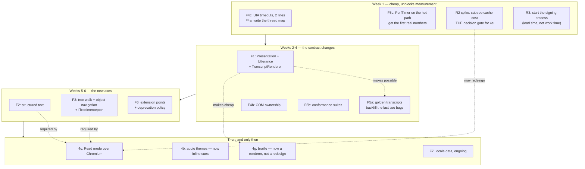

# The Foundation

Written 2026-08-03. Companion to [`NVDA_ANALYSIS.md`](NVDA_ANALYSIS.md), which
is the evidence for everything asserted here.

This document defines what has to exist **before** feature work resumes. Not a
wish list and not a roadmap — a set of seams, invariants and harnesses that
everything after them is built inside.

---

## The test for what belongs here

A thing belongs in the foundation if it satisfies all three:

1. **Many features depend on it.** Not one.
2. **It gets more expensive with time.** Adding it after N features means
   rewriting N features.
3. **Working around it is possible.** Which is the trap: a missing seam does
   not stop work, it produces a parallel path that quietly becomes permanent.

`CaretLineTracker` is the worked example. It was competent code that worked
around a missing text model, it grew to 671 lines and four hand-tuned timing
constants in about two months, and removing it required deleting it outright.
`ASSESSMENT.md` S4 is right that the accumulation was not caused by twenty
years of history — it was caused by a missing seam. Everything below is a seam
whose absence is currently producing the same effect, or would as soon as the
next feature lands.

There are seven. Three are contract changes to code that already exists, two
are new axes, one is a policy, and one is a harness.

**Each has its own implementation spec in [`foundation/`](foundation/)** —
contracts in real C#, a file-by-file plan, a migration order, the proof that it
landed, and the open questions the implementing session has to close. This
document is the map; those are the ground. The capability scoreboard the whole
plan is measured against is [`CAPABILITIES.md`](CAPABILITIES.md).

---

## F1 — The output model: a presentation, rendered by many

> Full spec: [`foundation/F1-OUTPUT-MODEL.md`](foundation/F1-OUTPUT-MODEL.md)

**The problem.** `SpeechUtterance` is `record(string Text, ProsodyHint Prosody,
string? VoiceId, ...)`. One string, one prosody, one voice, for the whole
utterance. That cannot express a French quotation inside an English line, a
capital raised in pitch, an earcon *inside* an announcement rather than queued
behind it, a pause that is not a comma, or a position marker that say-all can
resume from. NVDA needed all seven of those and built `SpeechSequence` to carry
them; see `NVDA_ANALYSIS.md` §2.2.

**And one more, found after that document was written, which is the reason F1
goes first.** A flat string cannot carry a *validity predicate*, and every
speech bug of the last month is the same bug: *is this announcement still
wanted?*, answered with timing instead of state. NVDA attaches a
`FocusLossCancellableSpeechCommand` to focus announcements and evaluates it at
the moment the utterance would be spoken — stale announcements evaporate, valid
ones survive, and there is no race because there is no timing. Cancel-on-input
cannot tell those two cases apart, which is precisely why it produced both
symptoms: speech an item behind when it cancelled too little, silence on
backspace when it cancelled too much. The spec has the detail.

It also cannot be rendered to braille, and that is the more expensive half.
NVDA has two independent renderers — `speech.speakTextInfo` and
`braille.TextInfoRegion` — that each decide what a control's presentation is,
with different rules, and they disagree in small ways forever. Aura has no
braille yet, which means it still has the choice. Making it later is making it
wrong.

**The contract.** Two layers, in `Reader.Abstractions/Output/`.

A `Presentation` is what the rule engine produces: *what should be conveyed*,
in order, with enough structure that any output device can render it.

```csharp
public sealed record Presentation(
    IReadOnlyList<PresentationSegment> Segments,
    SpeechReason Reason,
    string? Subject,                       // node id — what the arbiter keys on
    SpeechPriority Priority,
    string? CancelGroup,
    IValidityPredicate? Validity,          // "is this still worth speaking?"
    IReadOnlyList<string> RuleTrace);

public sealed record PresentationSegment(
    string Text,
    SegmentKind Kind,                      // Name, Role, Value, State, Position, Structure, Content
    AccessibleRole? Role,
    IReadOnlyDictionary<string, object?>? Attributes,
    ITextRange? Source);                   // for braille routing and say-all tracking
```

An `Utterance` is what a *speech* renderer produces from it — the sequence NVDA
proved is necessary:

```csharp
public abstract record OutputPart;
public sealed record TextPart(string Text)                : OutputPart;
public sealed record SpellPart(string Text)               : OutputPart;
public sealed record LanguagePart(string BcpTag)          : OutputPart;
public sealed record ProsodyPush(ProsodyHint Delta)       : OutputPart;
public sealed record ProsodyPop()                         : OutputPart;
public sealed record BreakPart(TimeSpan Duration)         : OutputPart;
public sealed record CuePart(string CueId)                : OutputPart;   // earcon, inline
public sealed record MarkerPart(int Id)                   : OutputPart;   // index / callback
public sealed record UtteranceBoundary()                  : OutputPart;   // chunk here

public sealed record Utterance(
    IReadOnlyList<OutputPart> Parts,
    SpeechPriority Priority,
    string? CancelGroup,
    IValidityPredicate? Validity,
    IReadOnlyList<string> RuleTrace);
```

Three renderers implement `IPresentationRenderer<T>`:

| Renderer | Output | Why it exists now |
|---|---|---|
| `SpeechRenderer` | `Utterance` | The only one shipping today |
| `BrailleRenderer` | a braille line + cursor routing table | So 4g is a driver, not a redesign |
| `TranscriptRenderer` | one deterministic line of text | **This is what the golden-transcript harness asserts on (F5)** |

That third row is the reason to do this first. The transcript renderer is a
pure function from `Presentation` to a string, with no engine, no timing and no
Windows. It is what makes announcement behaviour testable at all.

**The invariant.** *Nothing constructs output text. Everything constructs a
`Presentation`.* `ISpeechEngine` stops taking a string. `OutputArbiter`
evaluates a `Presentation`. The rule engine's templates produce segments, not
concatenated strings.

**Migration.** `SpeechTemplate` already produces tokenised output
(`{name}`, `{role}`, `{value}`, `{position}`, `{level}`) — the tokens *are* the
segments. This is closer to a re-typing than a rewrite. `SpeechUtterance` stays
for one API version as a shim that wraps a single `TextPart`.

**Proof it landed.** Every existing speech test passes through
`TranscriptRenderer` instead of asserting on `.Text`, and a new test speaks a
line containing a `lang`-attributed run and asserts the `LanguagePart` is
emitted.

---

## F2 — Structured text: what did I enter, and what did I leave

> Full spec: [`foundation/F2-STRUCTURED-TEXT.md`](foundation/F2-STRUCTURED-TEXT.md)

**The problem.** `ITextRange.GetAttributes()` answers "is this whole range
bold?" It cannot answer "moving from here to there, what did I enter and
leave?" — and structure boundaries are most of what Read mode says. "List, five
items. Bullet. Buy milk. … Out of list." requires knowing the list was entered
and later exited, and at what nesting depth.

NVDA's answer is `getTextWithFields()`: text interleaved with
`controlStart`/`controlEnd`/`formatChange` commands. It is the second half of
the `TextInfo` idea and Aura took only the first half.

Without it, `IReadModeBuffer` will read text from the buffer and re-derive
structure from the tree — two sources for one document, drifting. That is the
exact failure the interface's own doc comment says the design exists to
prevent.

**The contract.** Additive to `ITextRange`, with a default implementation so no
existing backend breaks:

```csharp
public enum StructureEdge { Enter, Exit }

public abstract record TextSegment;
public sealed record TextRun(
    string Text,
    IReadOnlyDictionary<string, object?> Attributes) : TextSegment;
public sealed record StructureMarker(
    StructureEdge Edge,
    AccessibleRole Role,
    IReadOnlyDictionary<string, object?> Attributes) : TextSegment;

public interface ITextRange
{
    // ...existing members...

    /// Default: one TextRun over GetText() with GetAttributes().
    IReadOnlyList<TextSegment> GetContent() => [new TextRun(GetText(-1), GetAttributes())];
}
```

`StringTextSurface` keeps the default. `NativeUiaTextRange` implements it
properly from `GetChildren()` plus attribute ranges. `IReadModeBuffer`
implements it as its native output — because for a virtual buffer, structured
content is what it *has*, and flat text is the derived thing.

**Why now.** Table navigation, list announcement, heading announcement, link
announcement, blockquote and code-block reporting, and braille structure
indicators all consume this. All of them are cheaper to build after it and
impossible to retrofit cleanly.

**Proof it landed.** A synthetic document with a nested list produces the right
enter/exit sequence, and `TranscriptRenderer` turns it into
`"list, 2 items / bullet, one / list, 1 item / bullet, one point one / out of list / out of list"`.

---

## F3 — Navigation: three cursors and one interceptor

> Full spec: [`foundation/F3-NAVIGATION.md`](foundation/F3-NAVIGATION.md)

**The problem, part one: a missing axis.** NVDA has a *navigator object* — a
cursor that walks the raw accessibility tree independent of focus, with
parent/child/next/previous and "move focus here". It is how a blind user
inspects a window, finds a status bar, reads a non-focusable label, or
investigates something that has no text. Aura has a review cursor over *text*
and nothing over the *tree*. This is not a missing feature; it is a missing
axis, and it is one of the first things a switching NVDA user will reach for
and not find.

**The problem, part two: Read mode is a special case.** `IReadModeBuffer` is
shaped like a web page. But "an object that takes over navigation and event
handling for a subtree" also describes a terminal, a Word document, a
spreadsheet, a chat transcript and a PDF. NVDA calls it a tree interceptor and
browse mode is one instance. Generalising now is nearly free; generalising
after Read mode ships means retrofitting terminals into a contract that assumed
HTML.

**The contract.**

```csharp
// The tree walk core does not have today.
public interface IAccessibilityProvider
{
    // ...existing members...
    AccessibleNode? Parent(NodeId id, TreeView view = TreeView.Control);
    AccessibleNode? FirstChild(NodeId id, TreeView view = TreeView.Control);
    AccessibleNode? NextSibling(NodeId id, TreeView view = TreeView.Control);
    AccessibleNode? PreviousSibling(NodeId id, TreeView view = TreeView.Control);
    AccessibleNode? ContainingWindow(NodeId id);      // closes the S9 layering leak
}

public enum TreeView { Raw, Control, Content }        // UIA's three, and AT-SPI's equivalent

// The general form of Read mode.
public interface ITreeInterceptor
{
    AccessibleNode Root { get; }
    bool IsCurrent { get; }
    ITextSurface Surface { get; }                     // IReadModeBuffer is this, plus FindNext
    bool HandlesEvent(AccessibilityEvent e);
    GestureLayer GestureLayer { get; }                // claims `h`, `k`, Ctrl+Alt+arrows…
}
```

The three cursors and their relationship become explicit, because "which cursor
am I moving" is the second-most-common source of user confusion after mode:

| Cursor | Owns | Moved by | Follows |
|---|---|---|---|
| **System** | focus + caret, owned by the app | the app, and Write mode keys | — |
| **Review** | an `ITextRange` | Reader+arrows | the system caret, loosely |
| **Object** | a `NodeId` + `TreeView` | Reader+numpad / bracket keys | the system focus, loosely |

**Note on naming.** With Type renamed to Write, the pair is `ReaderMode.Read` /
`ReaderMode.Write`, `Write = 0`. Done, built, tests green.

**Proof it landed.** Object navigation works over the synthetic tree in a unit
test with no Windows, and a `SyntheticTreeInterceptor` proves the seam by
claiming a gesture layer.

---

## F4 — Liveness: threads, COM lifetime, and backpressure

> Full spec: [`foundation/F4-LIVENESS.md`](foundation/F4-LIVENESS.md)

This is the foundation that decides whether Aura is a screen reader or a
prototype, because the worst failure this program has is going silent with no
explanation, and every path to that failure runs through this section.

### F4a — Write down the thread map

There are five threads and no document saying so: the UIA event thread(s) that
COM calls back on, the dispatch loop, the speech drain loop, the STA UI thread,
and the keyboard hook thread. Which objects may cross which boundary is
currently folklore. It needs one page, and the page needs to be enforceable —
`Debug.Assert(OnDispatchThread)` at the boundaries.

### F4b — COM object lifetime is owned, never collected

**This is the one inherited mistake.** NVDA issue #11398: Python's GC releases
COM proxies on arbitrary threads at arbitrary times; a blocking `Release()`
into a hung provider deadlocks against the main thread. The fix was to turn
automatic GC off.

.NET has the identical hazard. A `IUIAutomationElement` RCW finalized by the
.NET finalizer thread issues `Release()` from a thread Aura does not control,
at a moment it does not choose, into a process that may be wedged. It will be
rare, it will be unreproducible, and it will present as the reader freezing.

The invariant, stated so it can be enforced:

> **No UIA interface pointer is reachable from a finalizer.** Every native
> element is held by an owning wrapper with explicit disposal. Release happens
> on the thread that created it, drained from a release queue. `ComWrappers`
> with `CreateObjectFlags.UniqueInstance` and `GC.SuppressFinalize` — not
> runtime-callable-wrapper defaults.

`NativeUiaProvider` currently passes `IUIAutomationElement` across a channel to
the dispatch loop. That is the exact object whose ownership needs deciding, and
deciding it now costs a day. Deciding it after browse mode holds thousands of
them costs a rewrite.

### F4c — Every cross-process call is bounded *and cancellable*

Win32 is done — `Win32Text.cs` uses `SendMessageTimeout` with
`SMTO_ABORTIFHUNG` and there is no bare `SendMessage` left. UIA is not.

Two cheap things are currently missing from `NativeUia.Create()`:

```csharp
if (automation is IUIAutomation2 two)
{
    two.ConnectionTimeout  = 1000;   // ms — give up connecting to a dead provider
    two.TransactionTimeout = 2000;   // ms — give up on a call that never returns
}
```

`IUIAutomation6.CoalesceEvents` and `ConnectionRecoveryBehavior` are already
set. The timeouts are the other half and they are two lines.

Beyond that, NVDA's `watchdog.cancellableExecute` — actually cancelling a hung
outbound RPC rather than waiting on it — has no equivalent here.
`ResponsivenessWatchdog` beeps, which converts a silent hang into a diagnosable
one and is worth having, but it does not recover. The escalation ladder should
be explicit: **beep → abandon the call → tear down and rebuild the provider →
tell the user, in speech, that it did.**

### F4d — Backpressure is a policy, not an accident

A busy page can raise thousands of events a second. `CoalesceEvents` helps at
the UIA layer; it does not define what happens when the dispatch channel fills.
Today that is unspecified. It needs to be: a bounded channel, with a documented
drop policy *per event kind* — focus and caret must never be dropped, live
regions and structure-changed may be, and dropping must be counted and visible
in diagnostics.

**Proof it landed.** A test harness that hangs a synthetic provider for ten
seconds and asserts the reader still answers a keystroke.

---

## F5 — Evidence: the harness that makes the rest safe

> Full spec: [`foundation/F5-EVIDENCE.md`](foundation/F5-EVIDENCE.md)

`DESIGN_PRINCIPLES.md` already says the right thing — "NVDA tests mostly run
against live applications. That's why subtle regressions ship." The synthetic
provider exists. The half that does not exist is the half that matters.

### F5a — Golden transcripts

The question a screen reader needs answered is: *given this tree and these
keystrokes, what did it say, in what order?* Once F1 exists,
`TranscriptRenderer` makes that a string, and a string can be committed to git.

```
tests/Transcripts/notepad-arrow-through-lines.transcript
tests/Transcripts/run-dialog-focus-and-type.transcript
tests/Transcripts/list-boundary-silence.transcript
tests/Transcripts/blank-lines-each-say-blank.transcript
```

Each file is a scenario (synthetic tree + input script) and its expected output
lines. CI diffs them. `--update-transcripts` regenerates, so the *diff* is what
gets reviewed — which is precisely the review that matters and the one nobody
currently does.

The last two filenames above are real bugs from the last two commits: blank
lines going silent, and the list-boundary over-suppression. Both were found by
a human on hardware, twice, after shipping. Both are one transcript file each.

**Nobody in this field has this.** It is the structural advantage that
compounds, and it is worth more than any feature on the roadmap.

### F5b — Conformance suites, not per-backend tests

`StringTextSurfaceTests` (21 tests) is described in `TEXT_MODEL.md` as "the
conformance suite every other backend should pass an equivalent of". It should
not be an equivalent — it should be *the same tests*, as an abstract xUnit
class instantiated per backend: string, Win32, native UIA, and later the
virtual buffer and AT-SPI. A backend that disagrees has a bug, and the suite
should be the thing that says so.

### F5c — Budgets, measured, in CI

`<50ms focus-to-speech` has been the headline principle since day one and has
never been measured. `PerfTimer` exists and is unused on the hot path. The
cache-request change that was supposed to turn ~27 round trips into 1 is still
listed as "not yet measured".

Named stages, each with a budget, asserted by a benchmark job:

| Stage | Budget |
|---|---|
| UIA event → dispatch loop | 5 ms |
| Node mapping (cached) | 5 ms |
| Rule evaluation → `Presentation` | 5 ms |
| Render → `Utterance` | 2 ms |
| Queue → engine `SpeakAsync` | 5 ms |

And one measurement that is not a budget but a **decision gate**: the
cross-process cost of building a virtual buffer over a real document with
`BuildUpdatedCache` on a `TreeScope_Subtree` cache request. NVDA concluded this
had to happen in-process. Aura's plan assumes it does not. That assumption is
currently unexamined and the whole of Read mode rests on it. Measure it before
designing around it — see R2.

### F5d — The scoreboard

`docs/CAPABILITIES.md`: every capability NVDA or JAWS has, one row each, with a
status of `shipped` / `planned` / `deliberately never`. `NVDA_ANALYSIS.md` §4
is the raw material.

The `deliberately never` column is the important one. Aura implements roughly 8
of NVDA's ~45 subsystems. Without an explicit never-list, every one of the
other 37 remains an implicit promise, and the project spends its life feeling
behind rather than choosing.

---

## F6 — Extension: wide enough that nobody reaches around it

> Full spec: [`foundation/F6-EXTENSION.md`](foundation/F6-EXTENSION.md)

**The problem.** NVDA has a `monkeyPatches/` directory in core. That is not
carelessness — it is what happens when the sanctioned surface is narrower than
what add-ons need. Aura's contract is versioned and gated, which is better, but
a *narrow* versioned contract plus .NET reflection produces the same outcome
with less visibility.

Today a plugin can register a `SpeechRule` and react to focus changes. That is
narrower than NVDA's surface in every direction.

**The contract.** Steal `extensionPoints` — it is the right shape:

```csharp
public sealed class Action<T>   { /* notify all */ }
public sealed class Filter<T>   { /* chain: T -> T */ }
public sealed class Decider<T>  { /* vote: any veto wins */ }
```

Declared where behaviour should be extensible, and at minimum:

- `Filter<Presentation>` — rewrite any announcement before it is rendered
- `Decider<Presentation>` — veto an announcement
- `Filter<GestureBinding>` — claim or remap a key in context
- `Action<ModeChange>`, `Action<FocusChange>` — observe

Plus the contract widening 4d already names — `IPluginCommand`, `IAudioTheme`,
`ISettingsPanel`, `ISpeechEngine`, `IInputSource` — and, new here from F3,
`ITreeInterceptor` and `ITextSurfaceProvider`.

**The policy that has to come with it.** A stated deprecation window: a member
marked obsolete in version N keeps working through N+2, and the compat shim
lives in one file so its cost is visible. NVDA breaks add-ons annually and it
is the loudest recurring complaint in its ecosystem. Aura will not avoid that
by accident.

---

## F7 — Locale and pronunciation data

> Full spec: [`foundation/F7-LOCALE.md`](foundation/F7-LOCALE.md)

**The problem.** Aura has a better rewriting *engine* than NVDA — YAML rules,
layered, with a rule trace — running on no locale data at all. NVDA has
per-locale symbol dictionaries, symbol levels (none/some/most/all/character),
character descriptions for spelling ("alpha, bravo"), and three tiers of user
speech dictionary.

The engine is the hard part and it is built. The data is the long part and it
has not started, and it is the kind of thing that is miserable to retrofit
because rules, tests and transcripts all reference it.

**What to decide now, before content exists:** the file layout, the resolution
order (built-in locale → user locale → voice → temporary), the symbol-level
model, and where character descriptions live. Then ship `en` and let
translators fill in the rest — but only once the format cannot change under
them.

---

## The risk register

Ordered by what would actually kill the project.

**R1 — The feedback loop is one person, testing in sessions.** This is the
largest risk and it is not technical. Cody tests by ear on Windows and reports
precisely, and every hardware round has found real bugs that a clean build and
passing tests did not — the last two commits are both such bugs, silence on
backspace and blank lines going quiet, and both were invisible from inside the
code. But session testing is not the same as depending on the thing daily, and
the gap shows up as bugs that survive a round because nobody spent four hours
inside them. *Mitigation: transcripts (F5a) do synthetically what a daily driver
would otherwise catch, which is why they rank above every feature; ship
something installable early; widen to two or three alpha users who will tolerate
a second screen reader running alongside. The Windows 11 VM available as of
2026-08-03 shortens the loop considerably and should be used to run the
measurement gates immediately rather than batching them.*

**R2 — The cross-process virtual buffer cost is unmeasured.** NVDA injects a
DLL into every process specifically because building a buffer across the
process boundary was too slow. Aura has deferred injection "indefinitely" on
coverage grounds, which is a different question. If the measurement says no,
Read mode's design changes fundamentally — and finding that out in week six of
4c is the expensive way. *Mitigation: a one-week spike that builds a subtree
cache over a large real page and reports the number, before any 4c design is
finalised.*

**R3 — The uiAccess certificate is the long pole and nothing gates on it.**
Without it, elevated windows are not merely unread — the keyboard hook does not
fire, so the reader appears frozen and the user cannot even stop speech. UAC
prompts, Task Manager, regedit, an elevated terminal, the logon screen. The
manifests are written; the certificate is not obtained. *Mitigation: start the
signing process now (Azure Trusted Signing or an EV cert), because the lead
time is weeks and it blocks a whole class of correctness.*

**R4 — COM/GC deadlocks.** See F4b. Rare, unreproducible, presents as a freeze.
*Mitigation: F4b, before more COM code exists.*

**R5 — Firefox needs IAccessible2 and there is no plan for it.** UIA is viable
for Chromium as of Chrome 138; Gecko has no native UIA provider. *Mitigation:
write it down as a scoped gap in the roadmap, ship Chromium first, and treat an
IA2 backend as a second `IAccessibilityProvider` if and when a user asks.*

**R6 — Scope.** 8 subsystems of 45. *Mitigation: F5d, and a real never-list.*

**R7 — AV false positives.** A signed binary that installs a low-level keyboard
hook, requests uiAccess and lives in Program Files is exactly the shape of a
keylogger. *Mitigation: sign everything, submit to the major vendors before the
first public release, and keep injection out of v1 — it is the single biggest
false-positive trigger and R2 may make it necessary anyway.*

**R8 — Localisation debt.** 60+ locales is NVDA's quietest moat. *Mitigation:
F7's format decisions now; translation later; never pretend it is close.*

**R9 — The add-on ecosystem cannot be matched.** A thousand Python add-ons is a
network effect and there is no interop path — Aura is C#, NVDA is Python.
*Mitigation: do not compete on count. Compete on the two things add-on authors
actually complain about: annual API breakage (F6's deprecation policy) and
undebuggable behaviour (the rule trace).*

---

## Sequencing

Nothing here is a feature, and that is the point. The estimate is for a
foundation phase, before 4b/4c resume.



**Week 1 is deliberately front-loaded with measurement and lead-time items.**
Two of them (the R2 spike and the certificate) can invalidate or block later
work, and both are cheap to start and expensive to start late.

**F1 before F5a** because the transcript renderer is a `Presentation` renderer;
the harness is nearly free once the model exists, and is awkward without it.

**F2 and F3 before 4c** because Read mode consumes both. Building 4c first
means building it twice.

---

## What this changes on the existing roadmap

| Item | Change |
|---|---|
| Phase 3.6 #5, #6 | Unchanged, still open. #6 (backspace/delete echo) is cheap after F1 — the deleted text is a segment. |
| 4b — audio themes | Cues become `CuePart` inside an utterance, not a parallel audio path. Cheaper after F1, and better. |
| 4c — Read mode | Gated on F2 + F3 + the R2 spike. Scope narrows to Chromium; Firefox/IA2 becomes an explicit named gap. |
| 4d — plugin widening | Absorbs F6. Extension points are new; the rest was already listed. |
| 4g — braille | Stops being a phase and becomes a renderer plus a driver. The braille *viewer* should ship before any hardware, as validation. |
| **new** | Object navigation (F3). Currently missing entirely and users will expect it. |
| **new** | Table navigation. A top-tier feature with no roadmap entry; falls out of F2. |
| **new** | Input help mode. Cheap, and its absence is conspicuous. |
| **new** | `docs/CAPABILITIES.md` (F5d) and the never-list. |
| S3 / uiAccess | Promote to a dated task. It blocks a class of correctness and has weeks of lead time. |

---

## The one-line version

Close three contract holes (output as a presentation, text with structure, COM
ownership), add two missing axes (object navigation, tree interceptors), build
the transcript harness that turns every future bug into a permanent test, and
measure the two numbers the whole plan rests on — before writing another
feature.
