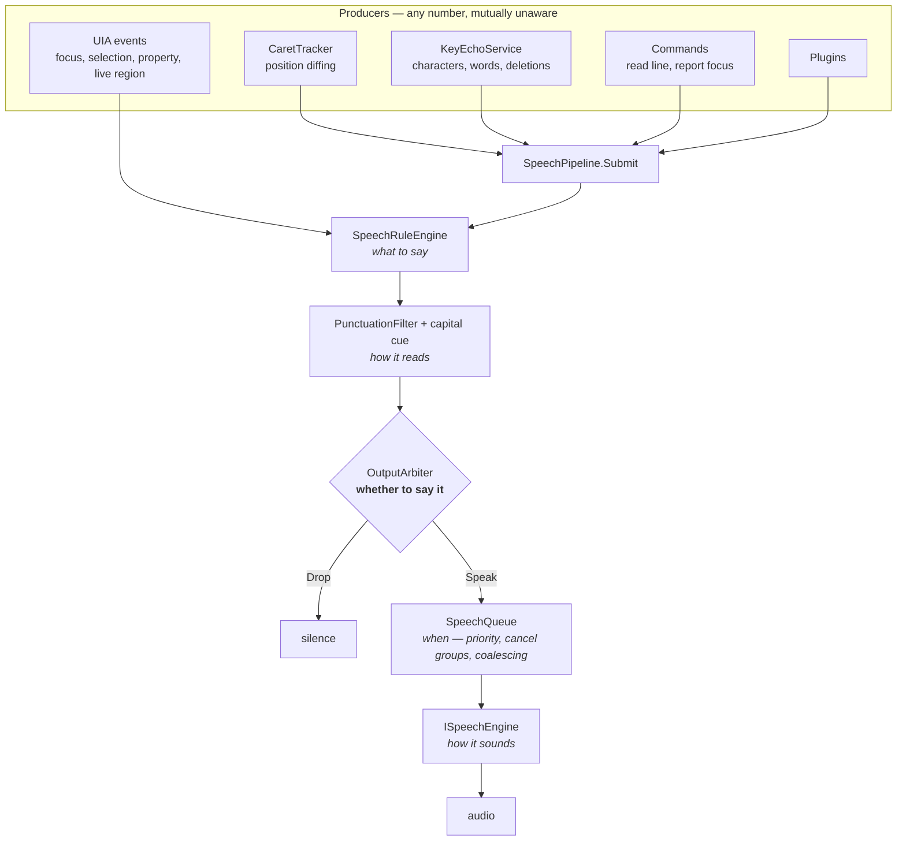

# The output path

Every spoken word in AURA travels one path. This is that path, and why each
stage exists.

---

## The problem it solves

AURA has many independent producers of speech: UIA focus events, selection
events, property changes, live regions, notifications, caret sampling, key
echo, lock-key announcements, command results, the tray, dialogs, and plugins.

Until the arbiter existed, each submitted straight to the speech queue. Nothing
decided precedence, so whenever two producers described the *same user action*
the user heard it twice. Every duplicate-speech bug found on hardware was an
instance:

| Symptom | Two producers |
|---|---|
| "speech, speech, list item" | focus event + selection event, same list item |
| Same item repeated at a list boundary | selection re-raised for an item that never moved |
| Caret line announced twice | keystroke sample + UIA caret event |

Each was patched at its source. That does not scale: the next producer collides
with the ones already there, and suppression logic ends up spread across
whichever components happen to know about each other — which is precisely the
accumulation this project exists to avoid.

---

## The path

**Four decisions, four owners.** This separation is the design:

| Stage | Decides | Does not decide |
|---|---|---|
| `SpeechRuleEngine` | **what** the words are | whether they are worth saying |
| `PunctuationFilter` | **how they read** | ordering |
| `OutputArbiter` | **whether** to speak at all | ordering or timing |
| `SpeechQueue` | **when** — priority, preemption, coalescing | content |
| `ISpeechEngine` | **how it sounds** | everything else |

When these blur, the only available fix is another timer. The previous round of
bugs was fixed with four of them (a 15 ms delay, a 250 ms suppression window, a
400 ms duplicate filter, a 40 ms cache refresh); none survive.

---

## The arbiter

`Aura.Output.OutputArbiter` is the single choke point. Two rules, deliberately
only two.

**1. Same subject, lower category, close in time → drop.**

Announcements are ranked by what they may interrupt:

| Category | Examples | May interrupt |
|---|---|---|
| `UserRequested` | read line, report focus, report time | everything; never suppressed |
| `Echo` | character, word, deleted character | navigation and below |
| `Navigation` | focus, selection, caret moved | state and ambient |
| `StateChange` | value changed, checkbox toggled | ambient |
| `Ambient` | live regions, notifications, toasts | nothing |

A list raising both focus and selection for one arrow press produces one
announcement: focus is `Navigation`, selection is `Navigation`, and the second
loses on arrival order within the coincidence window.

**2. Identical text repeated immediately → drop.**

Arrowing past the end of a list re-raises the event for an item that never
moved. Repeating it tells the user nothing; **silence is the signal that they
are at the boundary**, which is what NVDA does and what users expect.

`UserRequested` is exempt: pressing "read current line" twice must say the line
twice, because the user asked twice on purpose.

### The window

`CoincidenceWindow` is 120 ms and deliberately short. It is not a debounce
hiding a race — the producers it arbitrates fire within a few milliseconds of
each other because they are reacting to one event. A long window would start
swallowing genuinely separate announcements, which is the worse failure.

---

## Where things belong

Rules for anyone adding a producer:

- **Never call `SpeechQueue.Enqueue` directly.** Go through
  `SpeechPipeline.Submit`, which routes through the arbiter. Bypassing it is
  how the duplicate bugs came back.
- **Pick the honest `SpeechReason`.** It determines the category, and therefore
  what your announcement may silence. Do not use `UserAnnouncement` for
  something the user did not request — it is the one category that suppresses
  nothing and is suppressed by nothing.
- **App-specific behaviour goes in an app module**, never in a producer.
- **A new kind of announcement gets a new `SpeechReason` and a category**, not
  a special case inside a producer.

---

## What is not here yet

The arbiter is speech-only. Braille (4g) and audio themes (4b) are additional
*outputs*, not additional producers — the same arbitrated decision should fan
out to all three, so a suppressed announcement is suppressed everywhere and a
braille display never shows text the user was not told about.

That is why this lives in `Aura.Output` rather than in `Aura.Speech`: the
project's stated purpose is arbitrating speech *versus braille versus earcons*,
and the shape is already right for it.
