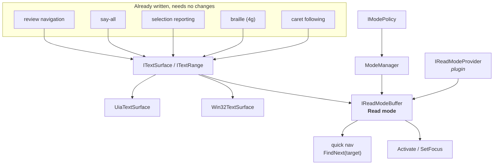

# Read mode and Write mode

Status: **contracts sketched, nothing implemented.** This is the frame for
Phase 4c, written so the work can be picked up and filled in.

---

## The names

Traditionally these are "browse mode" and "focus mode" (NVDA), or the virtual
cursor being on and off (JAWS). Those names describe the *screen reader's*
internal state. **Read** and **Write** describe what the user is doing.

That is not cosmetic. "Am I in browse mode or focus mode" has needed explaining
to every new user for twenty years, and the confusion is real: people cannot
tell you which mode they are in, so they cannot tell you what went wrong.
"Am I reading, or am I writing" needs no explanation at all, and the failure
mode — "I'm trying to write and it's reading" — describes itself.

**Write, not Type.** The pair has to read as a pair, and Read/Write is a
distinction every computer user already holds. It also covers the cases that
are not literally typing — pressing a button, ticking a checkbox, dragging a
slider — all of which are "the application gets the keystroke", and none of
which are typing. The third reason is local: this is a C# codebase, `Type` is
already the most overloaded word in it, and `ReaderMode.Type` sitting next to
`System.Type` helps nobody.

| Mode | Keystrokes go to | Arrows do | Single letters do |
|---|---|---|---|
| **Read** | The reader | Move through the document | Jump between elements (`h` heading, `k` link) |
| **Write** | The application | Whatever the app does | Type |

---

## Why this is the hardest feature, and it isn't the flattening

Turning a document tree into a line of text is the obvious part and the easy
part. Three other things are hard:

**Staleness.** Modern pages mutate constantly. A buffer built a second ago may
no longer match the document, and a stale buffer is worse than no buffer — it
announces text that is not on screen and activates the wrong element. Rebuild
too often rather than trusting a stale one. `IReadModeBuffer.IsCurrent` exists
to make this explicit rather than hoped for.

**Mode switching.** Automatic switching is what makes the feature usable and
also what makes users furious. Land in a search box, start typing, and the
reader must already be in Write mode. Land in a rich-text editor to proof-read,
and it must not be. There is no universally correct answer, which is exactly
why `IModePolicy` is a separate, replaceable interface with per-app and
per-site overrides, and why `RespectsManualOverride` exists — a user who
manually switches must not be thrown back by the next focus event.

**Position stability.** The user's place in the document has to survive the
buffer being rebuilt. Losing it drops them at the top of a page they were
halfway through, which for a blind user is not a minor annoyance.

---

## The design

**`IReadModeBuffer` extends `ITextSurface`, and that is the whole design.**

Review navigation, say-all, selection reporting, caret following and braille
are already written against `ITextRange` and have no idea what is behind it.
Making Read mode another backend means all of them work over a web page on the
day it ships, with no changes to any of them.

This is the single most important thing to copy from NVDA. Its browse mode is a
`TextInfo` implementation, which is why the rest of NVDA kept working when
browse mode landed. A screen reader that builds a *separate* navigation stack
for web content maintains two of everything, and they drift — differently
computed word boundaries, differently behaving say-all, two sets of bugs.

Quick navigation then falls out of what already exists: step by `TextUnit`,
test `GetAttributes()`, repeat until a match. That is why `TextAttributes`
carries `HeadingLevel` and `Link` from the start even though no shipped backend
populates them yet.

### Contracts

| Type | Role |
|---|---|
| `ReaderMode` | `Read` or `Type` |
| `NavigationTarget` | What quick-nav jumps between; each binds to a letter |
| `IReadModeBuffer : ITextSurface` | The flattened document, plus `FindNext`, `Activate`, `SetFocus` |
| `IReadModeProvider` | Decides it can handle a document and builds a buffer. **A plugin contract** — core never knows about browsers. |
| `IModePolicy` | Decides which mode a focus target wants |

`FindNext` returns `null` at the end rather than wrapping. Silently wrapping to
the top loses a blind user completely: they press `h`, get a heading, and have
no indication they have travelled backwards past everything they already read.

---

## Keys

Follow NVDA and JAWS conventions exactly. Every switching user has these in
their fingers, and deviating buys nothing while costing all of them.

| Key | Jumps to |
|---|---|
| `h` / `1`–`6` | Heading / heading at level |
| `k` | Link |
| `b` | Button |
| `f` | Form field |
| `e` | Edit field |
| `x` | Checkbox |
| `r` | Radio button |
| `c` | Combo box |
| `l` | List |
| `i` | List item |
| `t` | Table |
| `d` | Landmark |
| `g` | Graphic |
| `q` | Block quote |

Shift reverses. Reader+Space toggles mode manually.

---

## Build order

Each step is demonstrable on its own, and none of it starts before the native
COM migration — see below.

1. **`ModeManager` + `IModePolicy` + manual toggle.** No buffer yet; Read mode
   just means "arrows drive the review cursor". Already useful, and it settles
   the mode-switching behaviour before any of the hard work.
2. **A buffer over one browser**, flattening the UIA tree. Reading only.
3. **Quick nav** — `FindNext` over `TextAttributes`.
4. **`Activate` / `SetFocus`** — following links, auto-switch to Write mode.
5. **Staleness handling** — structure-changed events, position recovery.
6. **Per-site overrides**, persisted in the profile.
7. **Second browser**, to prove the provider seam is real.

### The blocker

**Do not start step 2 before migrating to native `IUIAutomation`.**

`UiaTextRange.GetAttributes` documents the problem concretely: the managed
`System.Windows.Automation` client has no attribute for heading level
(`UIA_StyleIdAttributeId`, 40034) or link target (`UIA_LinkAttributeId`,
40035). Both arrived in UIA 3, after the managed client froze. Those two
attributes are exactly what steps 3 and 4 are built on.

Also missing and needed here: `UIA_NotificationEventId` and
`UIA_LiveRegionChangedEventId`, without which a web page's dynamic updates are
silent, and `CoalesceEvents`, without which a busy page will drown the event
loop.

Read mode is not merely slower on the managed client. Parts of it are not
expressible. Doing the migration first is not gold-plating; it is the
difference between step 3 taking a week and taking a month of workarounds that
then have to be deleted.
