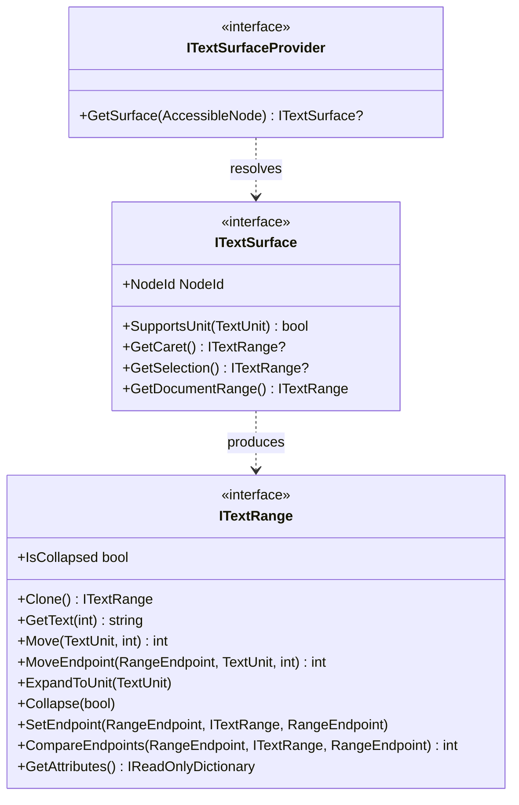
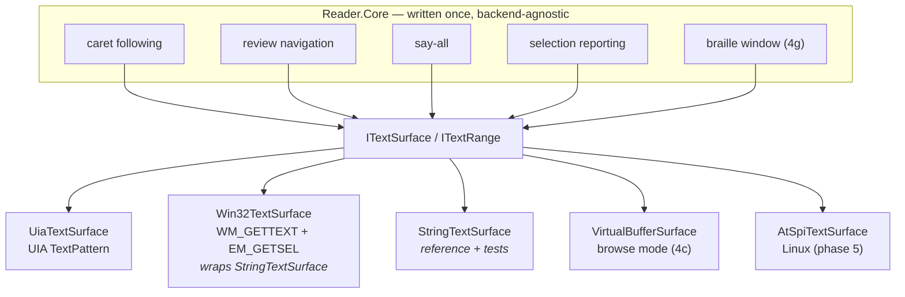
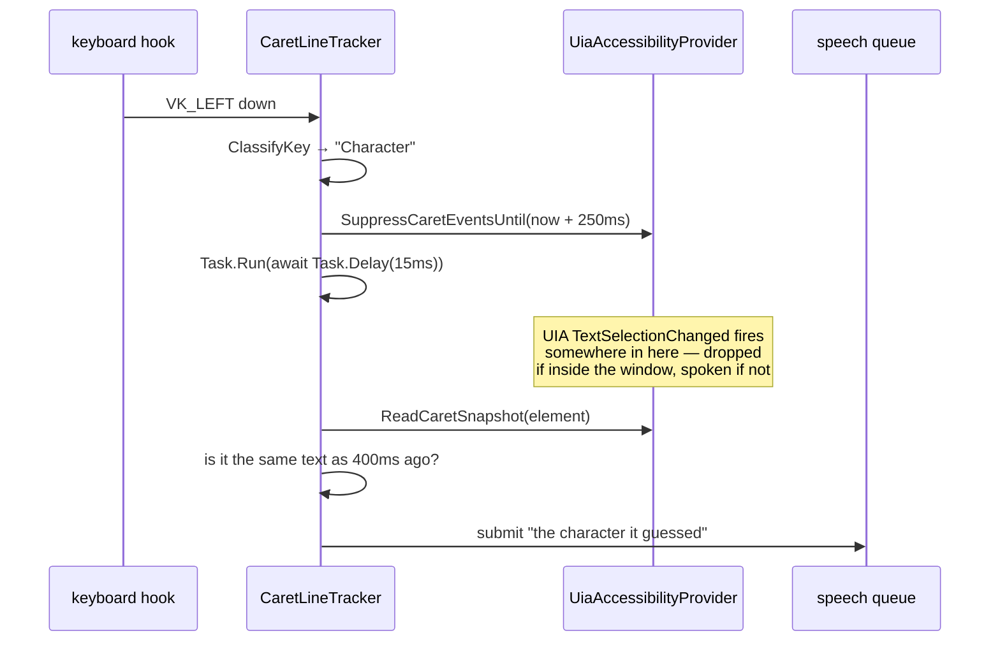
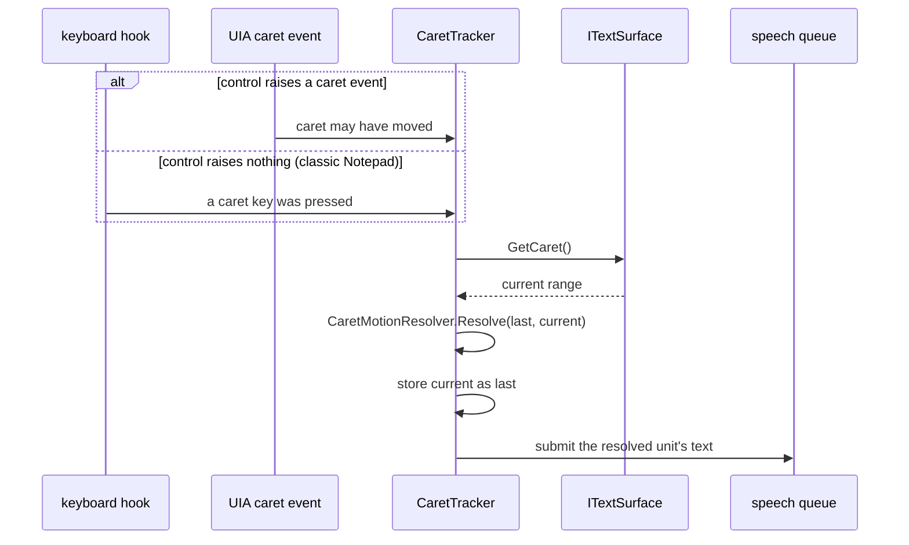

# The Text Model

Status: **landed and wired.** Contract, reference backend, both Windows
backends, the provider, the caret tracker and the review cursor are all in
place and compile-verified; none of it has been heard on real hardware yet.
See [`ASSESSMENT.md`](ASSESSMENT.md) S4 for why this exists.

---

## The problem it solves

A screen reader spends most of its life answering one question: *what text is
at this position, and what changed since last time?* Caret following, character
and word echo, backspace announcement, selection reporting, review navigation,
say-all, browse mode and braille are all that same question at different
granularities.

Today each of those is implemented separately, over `string`, with its own
boundary arithmetic and its own timing assumptions:

| Behaviour | Where it lives | Its idea of "a position" |
|---|---|---|
| Caret follow | `CaretLineTracker` | a keystroke, plus a 15 ms delay, plus a cached char |
| Character/word echo | `KeyEchoService` | the key that was pressed |
| Review cursor | `ReviewCursor` | an `int` offset into a cached string |
| Say-all | `SayAllRunner` | the review cursor's offset |
| Text content | `UiaTextContentProvider` | the whole buffer as one string |

Five representations of the same concept. They disagree, so they need timers to
negotiate — the 250 ms `SuppressCaretEventsUntil` window, the 400 ms duplicate
filter, the 150 ms queue coalesce, the 40 ms backspace refresh. Each timer is a
place where the correct answer depends on machine load.

One representation removes the need to negotiate.

---

## The contract



Three deliberate choices:

**Ranges are mutable positions, not value snapshots.** `Move` and
`ExpandToUnit` change the receiver; `Clone` is how you probe without
disturbing. This matches UIA `ITextRangeProvider` and NVDA's `TextInfo`
exactly. The alternative — immutable ranges — forces an allocation on every
probe, and there are many probes per keystroke.

**Failure is empty, not an exception.** A range whose control has gone away
returns `""` and `0`. Nothing on the speech path should need a `try`/`catch`
around a text read; the current code has fourteen of them.

**Units degrade rather than throw.** `SupportsUnit` lets a caller branch if it
wants to, but asking a plain-string backend for `TextUnit.Sentence` gets a line
rather than an exception — which is what UIA itself does.

---

## Backends

The point of the seam is that these are interchangeable, and everything above
the seam is written once.



### `StringTextSurface` — shipped

Lives in `Reader.Abstractions/Text` — with the contract, not with the reader.
It is the reference implementation of the contract, so plugin authors writing
their own surface (a terminal, a custom document) get a working model to
compare against, and the Win32 backend can wrap it without the platform
assembly having to depend on Core. Three jobs:

1. **It is the executable specification.** `StringTextSurfaceTests` (21 tests)
   is the conformance suite every other backend should pass an equivalent of.
   Where a backend disagrees with it, the backend has a bug.
2. **It makes text behaviour testable without Windows.** Caret following can be
   driven from a synthetic document in a plain unit test — which is exactly the
   class of bug the roadmap notes can currently only be found "by running the
   exe."
3. **It is the adapter for any "whole text plus an offset" source.** Which
   brings us to:

### `Win32TextSurface` — shipped, and mostly free

Classic edit controls answer two messages: `WM_GETTEXT` gives the buffer,
`EM_GETSEL` gives the caret offset. That is precisely `StringTextSurface`'s
constructor.

As built (abbreviated). Note `SendMessageTimeout`, never `SendMessage` — see
`ASSESSMENT.md` S1:

```csharp
internal sealed class Win32TextSurface : ITextSurface
{
    private readonly nint _hwnd;
    private StringTextSurface Snapshot()
    {
        var text = ReadWindowText(_hwnd);        // WM_GETTEXTLENGTH + WM_GETTEXT
        var caret = ReadSelectionEnd(_hwnd);     // EM_GETSEL
        return new StringTextSurface(text, caret, NodeId);
    }

    public ITextRange? GetCaret() => Snapshot().GetCaret();
    // ...
}
```

Everything in `CaretLineTracker` from `TryReadWin32CaretLine` down —
`EM_LINEFROMCHAR`, `EM_LINEINDEX`, `EM_GETLINE`, the manual column arithmetic,
the manual word-boundary walk, roughly 120 lines — deletes. The boundary rules
live in one tested place instead of being re-derived per call site.

Re-snapshotting per read is not free, but a `WM_GETTEXT` against a legacy edit
is one message, and these controls are small by construction. Cache the
snapshot per keystroke if measurement says to.

### `UiaTextSurface` — shipped, thin

`TextPattern` maps to this contract almost one-to-one, because both are
descended from the same design.

| `ITextRange` | UIA |
|---|---|
| `Clone` | `ITextRangeProvider::Clone` |
| `GetText(max)` | `GetText(max)` |
| `Move(unit, n)` | `Move(unit, n)` |
| `MoveEndpoint(ep, unit, n)` | `MoveEndpointByUnit` |
| `ExpandToUnit(unit)` | `ExpandToEnclosingUnit` |
| `SetEndpoint(...)` | `MoveEndpointByRange` |
| `CompareEndpoints(...)` | `CompareEndpoints` |
| `GetAttributes()` | `GetAttributeValue` per well-known id |
| `ITextSurface.GetCaret()` | `GetSelection()[0]`, collapsed |
| `ITextSurface.GetDocumentRange()` | `DocumentRange` |

The mapping is mechanical. `GetAttributes` was the one real decision, and
building it surfaced a hard limit worth recording: **the managed UIA client
exposes no attribute for heading level or link target.**
`UIA_StyleIdAttributeId` (40034) and `UIA_LinkAttributeId` (40035) arrived in
UIA 3, after `System.Windows.Automation` froze. Those two are exactly what
browse-mode quick navigation is built on, so `UiaTextRange.GetAttributes` is
now the concrete, checkable form of the S2 argument: Phase 4c is not merely
slower on this client, parts of it are not expressible.

What it does return — language, bold, italic, underline, font size, font name —
follows the contract rule that a value is present only when it is uniform
across the range. UIA's `MixedAttributeValue` sentinel maps to "key absent",
because a half-bold range is not bold.

**`TextPatternRange` lifetime is the one sharp edge.** The current code notes
that ranges are only valid inside the event handler
(`UiaAccessibilityProvider.cs:271-280`). That is true of the *range object* in
some providers, which is why `UiaTextSurface` must re-acquire from
`GetSelection()` on each sample rather than holding one across events. The
contract permits that — `GetCaret()` is defined as "a range at the insertion
point now", not "the range you were given earlier."

### `VirtualBufferSurface` — Phase 4c, and the reason for all of this

Browse mode is a flattened, navigable rendering of a document's accessibility
tree. Expressed as an `ITextSurface`, it inherits review navigation, say-all,
selection reporting and braille **for free**, because those are written against
`ITextRange` and do not know what is behind it.

Quick-nav (`h` for next heading, `k` for next link) becomes a filtered `Move`:
step by `TextUnit.Line`, test `GetAttributes()[TextAttributes.HeadingLevel]`,
repeat. That is why `GetAttributes` is on the contract from the start even
though no shipped backend populates it yet.

Building 4c without this seam means building a second navigation stack in
parallel with the first, and then maintaining both. This is the specific
mistake this project exists to avoid.

---

## Caret following, before and after

### Before



Two producers, four timing constants, and the announcement depends on which
one won.

### After



One producer. The keystroke and the UIA event are both just *"it may be worth
re-sampling"* — they are interchangeable triggers, not competing sources of
truth, so no suppression is needed between them. Resolving to `None` when the
position is unchanged is what removes the duplicate-filter timer: two triggers
for the same movement resolve identically and the second announces nothing.

### How the resolver decides

`CaretMotionResolver.Resolve(previous, current)` builds a range spanning the
ground covered and reads it. The text between the two positions already encodes
which unit was crossed:

| Text between the positions | Motion | What is spoken |
|---|---|---|
| empty (positions equal) | `None` | nothing |
| contains `\n` or `\r` | `Line` | the line at the new caret |
| exactly one grapheme | `Character` | the character at the new caret |
| anything else | `Word` | the word at the new caret |

Selections are diffed directly: grew, shrank, or cleared, with the delta as the
text.

`CaretMotion.Text` may legitimately be empty — caret past the last character of
a line, or a blank line. Turning that into `"blank"` or `"end of line"` is a
presentation decision and stays in the speech layer, where the existing
`BlankLineToken` / `EndOfLineToken` constants already live.

**Caller responsibility:** do not diff across a content change. If the text
itself changed (the user typed, or an edit was undone) the two positions refer
to different documents and the delta is meaningless. That case is typing, and
key echo already owns it — the existing `TypingState` flag is the right gate.

---

## Migration

Ordered so that each step is independently shippable and nothing is broken
between steps.

**1. Contract and reference backend.** ✅ `Reader.Abstractions/Text/`,
`Reader.Core/Text/`, 40 tests. Nothing consumes it yet, so nothing can regress.

**2. `Win32TextSurface`.** ✅ Wraps `WM_GETTEXT` + `EM_GETSEL` over
`StringTextSurface`, using `SendMessageTimeout`. Write its conformance tests by
copying `StringTextSurfaceTests` against a real edit control in the integration
suite. Not yet wired to anything.

**3. `UiaTextSurface`.** ✅ Mechanical mapping over `TextPattern`. Its
conformance tests still need writing against a real control.

**4. `UiaTextSurfaceProvider`.** ✅ Owns the fallback chain — UIA text pattern,
then Win32, then a read-only `StringTextSurface` over `AccessibleNode.Value`.
This is the chain currently open-coded three times with three different
orderings.

**5. Rewrite `CaretLineTracker` as a sampler.** ✅ Deleted outright and
replaced by `CaretTracker` + `CaretFollowService` (Core, 12 tests). It becomes roughly: on trigger,
`GetSurface(focused)`, `GetCaret()`, `Resolve` against the stored previous,
submit, store. Both trigger sources feed the same path.
`SuppressCaretEventsUntil` is deleted from `UiaAccessibilityProvider` along
with all four timing constants. Expect the file to lose most of its 671 lines.

**6. Reimplement `ReviewCursor` over `ITextRange`.** ✅ It becomes a held range
plus `Move`/`ExpandToUnit`. Roadmap 3.6 #3 ("review cursor doesn't track the
caret") stops being a feature to build: the review range and the caret range
are the same type over the same surface, so following is a `SetEndpoint` call.
Keep the existing public method names so `CommandBindings` does not change.

**7. Reimplement `SayAllRunner`** as a document-range walk by line, holding a
bookmark range to resume from. This also fixes the stale-snapshot problem
`ReviewCursor.Refresh` currently patches around.

**8. Retire `ITextContentProvider`.** Once every consumer is on
`ITextSurface`, `GetText(node)` is `GetSurface(node).GetDocumentRange()
.GetText()`. Keep it as a shim for one release so app modules do not break, and
remove it at the next API version bump.

Steps 1–4 add code and touch no existing behaviour. Step 5 is the one with
user-visible risk, and it is where the acceptance test is the one the roadmap
already names: arrow around Notepad and the Run box on the running exe.

---

## Conformance

`tests/Reader.Core.Tests/Text/StringTextSurfaceTests.cs` is the specification.
A backend is correct when it passes an equivalent suite. The cases that matter
most, because they are where backends actually differ:

- line expansion excludes the newline, and handles `\r\n`
- a word is a run of non-whitespace — `don't` and `well-known` stay whole
- character movement is by grapheme cluster, not UTF-16 code unit (an emoji is
  one character; the current Win32 path returns half a surrogate pair)
- `Move` reports how far it *actually* got, which is how a caller detects a
  document boundary
- an empty document, a blank line, and a caret past the last character are all
  navigable without throwing
- `Clone` is independent

`CaretMotionResolverTests.cs` covers the resolution rules, including the three
cases the keystroke-classification approach cannot get right:
`Left_arrow_at_the_start_of_a_line_is_a_line_move_not_a_character_move`,
`A_caret_move_with_no_keystroke_at_all_still_resolves`, and
`An_emoji_is_one_character_not_two_halves`.

---

## Open questions

- **Attribute fetch cost.** `GetAttributes()` over UIA is one cross-process
  call per attribute unless batched. Browse mode will call it per line. Needs
  measurement, and probably a `GetAttributes(params string[] keys)` overload so
  callers ask only for what they will use.
- **Bookmarks across content changes.** Say-all over a live document (a log
  tailing, a chat view) needs a range that survives edits. UIA offers no stable
  bookmark. Likely answer: re-anchor by offset and accept drift, with a
  structure-changed event forcing a re-read.
- **Whether `ITextRange` should carry its surface.** It currently does not
  expose one. `CompareEndpoints` returns 0 across surfaces rather than throwing,
  which is safe but silent. A `Surface` property would let callers assert. Left
  out for now to keep the contract minimal.
